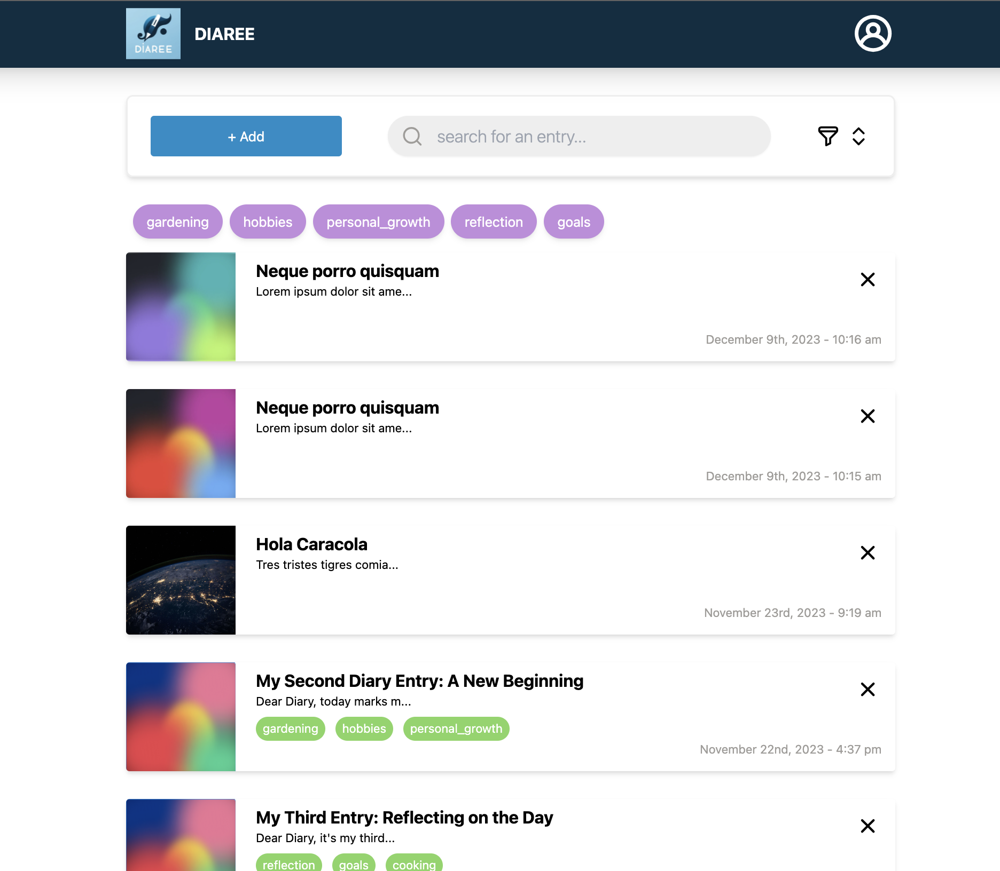

# Diaree - Where Memories Meet Technology
Experience the synergy of elegance and power in this full-stack diary desktop app. Securely store your memories in style with a seamless blend of user-friendly design and advanced backend capabilities.


<p float="left">
  
   
</p>


# 📚 Getting Started

To install and use this project, take the following steps:

First, make sure you have **Node.js** and **npm** installed on your local machine. Follow the steps written [here](https://docs.npmjs.com/downloading-and-installing-node-js-and-npm).

After you finished installing:
- Fork this project and clone it in your machine. Feel free to use any text editor of your preference. 
- Once you have it cloned in your machine, install all the necessary dependencies for `main` and both folders: `Client` and `Server` by running the following command.

```ts
  // to go to each folder
  cd client
  cd server

  // command to install dependencies
  npm install || npm i
```
To launch the entire application, use two separate console views and run the following commands, starting with the `Server` and moving on to the `Client`:

```ts
  // for the server
  npm start

  // for the client
  npm run dev
```


Additionally, you can use the following command to add preconfigured diary entries to your database: 
```ts
// go to server/utils folder
cd utils

// run this command in your server's console
npm run seedDB

// you can also do the 2 steps before in just one line
cd utils && npm run seedDB
```

And last but not least, make sure you have an account in [Cloudinary](https://cloudinary.com/) to be able to upload images and use this app. Once you have an account, create and `.env` file in the server where to store the following information:

```ts
CLOUDINARY_CLOUD_NAME=xxx
CLOUDINARY_API_KEY=xxx
CLOUDINARY_API_SECRET=xxx
```
IMPORTANT: Once you have created this `.env` file, please be careful and DO NOT publish anywhere.


# 📚 Tech Stack
The app's development involved the following technology stack:

- The application is exclusively coded in *TypeScript*.
- **Backend Technologies:** *Node.js* in conjunction with *Express*, and *MongoDB with Moongoose* for the databases.
- **Frontend Technologies:** *React* paired with *TailwindCSS*.
- Furthermore, the backend boasts comprehensive test coverage facilitated by *Jest*, *Supertest*, and *Mockingoose* libraries.

# 📚 Contributors

This application represents a legacy project that underwent enhancements led by [Dinara Bekeshova](https://github.com/dinarabs) and [Pilar Cuéllar Taracido](https://github.com/PilySwatch), focusing on refining its visual aesthetics and transitioning the entire codebase to TypeScript. The initial iteration of the application was authored by [Oguz Tugan](https://github.com/dayt47), and the original source code is accessible in this repository: https://github.com/dayt47/Diaree 

| <a href="https://github.com/dinarabs"><br>dinarabs</a> | <a href="https://github.com/PilySwatch"><br>PilySwatch</a> | 
|:---:|:---:|
